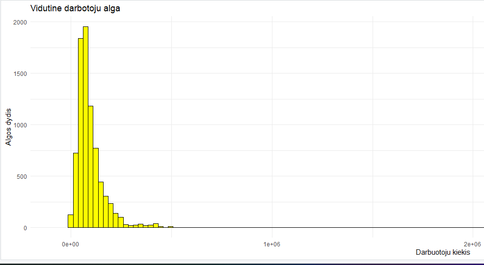
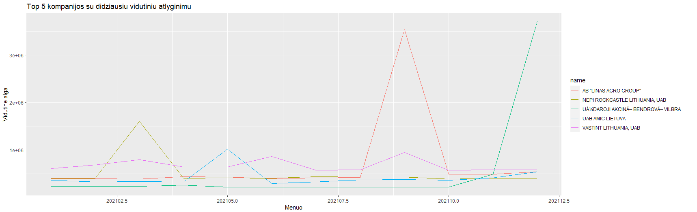
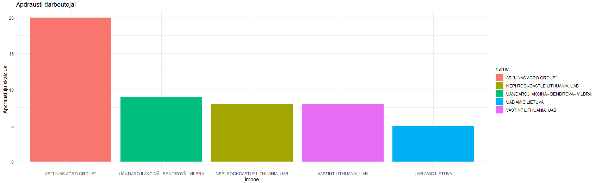
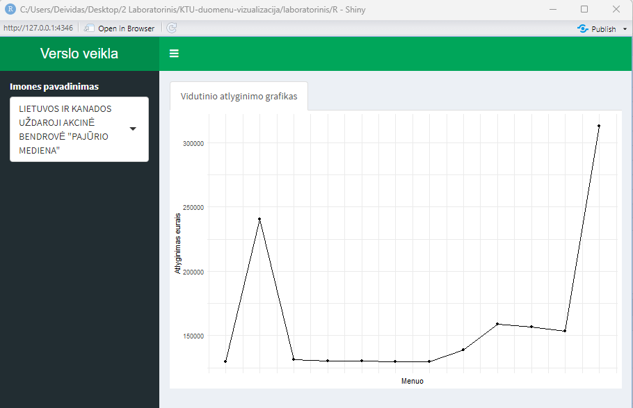

# R Laboratorinis darbas: duomenų vizualizacija

| Variantas | ecoActCode |
|------------- | ------------- |
|3   | 682000|

### 1. Užduotis

Atsakymas:
 

IÅ¡vados:Daugiausiai darbuotojø uþdirba apie 2000 eurø.

### 2. Užduotis

Atsakymas:
 

IÅ¡vados:Didþiausias vidutinis atlyginimas AMIC Lietuva

### 3. Užduotis

Atsakymas:
 

IÅ¡vados:Daugiausiai apdraustø darbuotojø dirba Linas Agro group

### 4. Užduotis

Shiny R aplikacijos nuotrauka:
 

